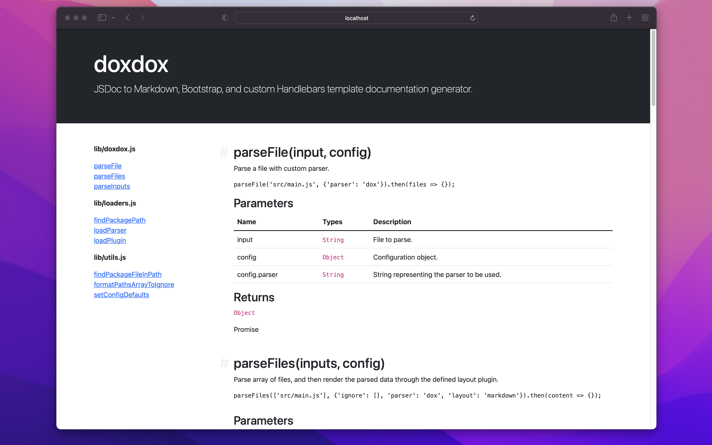

> ⚠️ Notice: This repository is undergoing a massive rewrite. Things will be missing, broken, or incomplete as development continues.


[](https://github.com/docsbydoxdox/doxdox/actions/workflows/test.workflow.yml)
[](https://www.npmjs.org/package/doxdox)
[](https://www.npmjs.org/package/doxdox)
[](https://doxdox.org)
[](https://discord.gg/nNtFsfd)

> Documentation, simple.

doxdox is a simple to use documentation generator that takes [JSDoc](https://jsdoc.app/) comment blocks and generates different documentation formats; [Markdown](https://daringfireball.net/projects/markdown), [Bootstrap](https://getbootstrap.com/), [GitHub Wiki](https://docs.github.com/en/communities/documenting-your-project-with-wikis/about-wikis), and other custom plugins.

doxdox also features support for extendibility via custom plugins for both parsing and generating documentation.

## Example

### In

```javascript
/**
 * Finds package.json from either the directory the script was called from or a supplied path.
 *
 *     console.log(await findFileInPath('./'));
 *     console.log(await findFileInPath('./package.json'));
 *     console.log(await findFileInPath('~/git/github/doxdox/'));
 *
 * @param {string} [input] Directory to check for file.
 * @param {string?} [fileName = 'package.json'] File name to check for.
 * @return {Promise<string | null>} Path to package.json file.
 * @public
 */
```

### Out



## Install

### Globally

```bash
$ npm install doxdox-cli@v4.0.0-preview.10 -g
```

### Locally

```bash
$ npm install doxdox@v4.0.0-preview.10 --save-dev
```

## Usage

### CLI

```bash
$ doxdox '**/*.js'
```

#### Custom Meta Information

##### Name

```bash
$ doxdox '**/*.js' --name "doxdox-next"
```

##### Description

```bash
$ doxdox '**/*.js' --description "Preview release of the doxdox package"
```

#### Ignore

Files can be ignored via the command line.

```bash
$ doxdox '**/*.js' --ignore tests/**/*.js
```

```bash
$ doxdox '**/*.js' --ignore **/*.test.js
```

They can also be ignored via a `.doxdoxignore` file. This file is similar in format to `.gitignore` and `.npmignore`.

```
tests/**/*.js
**/*.test.js
```

#### Output

##### File

```bash
$ doxdox '**/*.js' --output docs.md
```

##### Stdout

```bash
$ doxdox '**/*.js' > docs.md
```

#### Renderers

##### Markdown

For more information on Markdown visit <https://daringfireball.net/projects/markdown>.

```bash
$ doxdox '**/*.js' --renderer markdown --output docs.md
```

##### Bootstrap

For more information on Bootstrap visit <https://getbootstrap.com>.

```bash
$ doxdox '**/*.js' --renderer bootstrap --output docs.html
```

#### JSON

```bash
$ doxdox '**/*.js' --renderer json --output docs.json
```

#### Help

```
Usage: doxdox <path> ... [options]

Options:

 -h, --help             Display this help message.
 -v, --version          Display the current installed version.
 -n, --name             Sets name of project.
 -d, --description      Sets description of project.
 -i, --ignore           Comma separated list of paths to ignore.
 -l, --parser           Parser used to parse the source files with. Defaults to jsdoc.
 -r, --renderer         Renderer to generate the documentation with. Defaults to Markdown.
 -o, --output           File to save documentation to. Defaults to stdout.
 -p, --package          Sets location of package.json file.

Included Layouts:

 - Markdown (default)    (https://daringfireball.net/projects/markdown)
 - Bootstrap             (https://getbootstrap.com)
 - JSON
```

### NPM Run Scripts

For more information on NPM run scripts visit <https://docs.npmjs.com/cli/v8/commands/npm-run-script>.

```bash
$ npm install doxdox@v4.0.0-preview.10 --save-dev
```

```json
{
  "devDependencies": {
    "doxdox": "4.0.0-preview.10"
  },
  "scripts": {
    "docs": "doxdox 'lib/**/*.js' --renderer markdown --output DOCUMENTATION.md"
  }
}
```

```bash
$ npm run docs
```

### JavaScript

> Note: To use doxdox in this way you must add `"type": "module"` to your `package.json` file.

```javascript
import doxdox from 'doxdox';

import parser from 'doxdox-parser-jsdoc';

import renderer from 'doxdox-renderer-markdown';

doxdox(
  process.cwd(),
  ['lib/index.js', 'lib/loaders.js', 'lib/utils.js'],
  parser,
  renderer,
  {
    name: 'doxdox-example',
    description: 'Description of doxdox example.'
  }
).then(output => {
  process.stdout.write(output);
});
```

### Next.js

> Note: To use doxdox in this way you must add `"type": "module"` to your `package.json` file.

```typescript
import type { NextPage } from 'next';

import doxdox from 'doxdox';

import parser from 'doxdox-parser-jsdoc';

import renderer from 'doxdox-renderer-bootstrap';

export const getServerSideProps = async () => {
  const docs = await doxdox(
    process.cwd(),
    ['lib/index.js', 'lib/loaders.js', 'lib/utils.js'],
    parser,
    renderer,
    {
      name: 'doxdox-example',
      description: 'Description of doxdox example.'
    }
  );

  return { props: { docs } };
};

const Docs: NextPage<{
  docs: string;
}> = ({ docs }) => {
  return <div dangerouslySetInnerHTML={{ __html: docs }}></div>;
};

export default Docs;
```

### Custom Renderer

> Note: To use doxdox in this way you must add `"type": "module"` to your `package.json` file.

```javascript
export default async doc => JSON.stringify(doc);
```

```bash
doxdox -r renderer.js
```

## Plugins

### Parsers

#### Default Parsers

> The following parsers are bundled with `doxdox`.

| Name                                                   | Description              | Version                                                                                                                                 |
| ------------------------------------------------------ | ------------------------ | --------------------------------------------------------------------------------------------------------------------------------------- |
| [doxdox-parser-jsdoc](./packages/doxdox-parser-jsdoc/) | JSDoc parser for doxdox. | [](https://www.npmjs.org/package/doxdox-parser-jsdoc) |

A template for creating your own parser [doxdox-parser-template](./packages/doxdox-parser-template/).

### Renderers

#### Default Renderers

> The following renderers are bundled with `doxdox`.

| Name                                                               | Description                    | Version                                                                                                                                             |
| ------------------------------------------------------------------ | ------------------------------ | --------------------------------------------------------------------------------------------------------------------------------------------------- |
| [doxdox-renderer-bootstrap](./packages/doxdox-renderer-bootstrap/) | Bootstrap renderer for doxdox. | [](https://www.npmjs.org/package/doxdox-renderer-bootstrap) |
| [doxdox-renderer-json](./packages/doxdox-renderer-json/)           | JSON renderer for doxdox.      | [](https://www.npmjs.org/package/doxdox-renderer-json)           |
| [doxdox-renderer-markdown](./packages/doxdox-renderer-markdown/)   | Markdown renderer for doxdox.  | [](https://www.npmjs.org/package/doxdox-renderer-markdown)   |

A template for creating your own renderer [doxdox-renderer-template](./packages/doxdox-renderer-template/).

#### Optional Renderers

> The following renderers are not bundled with `doxdox` and must be installed separately.

| Name                                                                   | Description                      | Version                                                                                                                                                 |
| ---------------------------------------------------------------------- | -------------------------------- | ------------------------------------------------------------------------------------------------------------------------------------------------------- |
| [doxdox-renderer-dash](./packages/doxdox-renderer-dash/)               | Dash renderer for doxdox.        | [](https://www.npmjs.org/package/doxdox-renderer-dash)               |
| [doxdox-renderer-github-wiki](./packages/doxdox-renderer-github-wiki/) | GitHub Wiki renderer for doxdox. | [](https://www.npmjs.org/package/doxdox-renderer-github-wiki) |
| [doxdox-renderer-pdf](./packages/doxdox-renderer-pdf/)                 | PDF renderer for doxdox.         | [](https://www.npmjs.org/package/doxdox-renderer-pdf)                 |

## Questions

If you have any questions regarding the use of doxdox, please use either [GitHub Discussions](https://github.com/docsbydoxdox/doxdox/discussions/) or [Stack Overflow](https://stackoverflow.com/questions/ask?tags=doxdox). The issue tracker is to be used for bug reports and feature requests only.

## Contributing

Be sure to review the [Contributing Guidelines](./CONTRIBUTING.md) before logging an issue or making a pull request.

## License

[MIT](./LICENSE)
