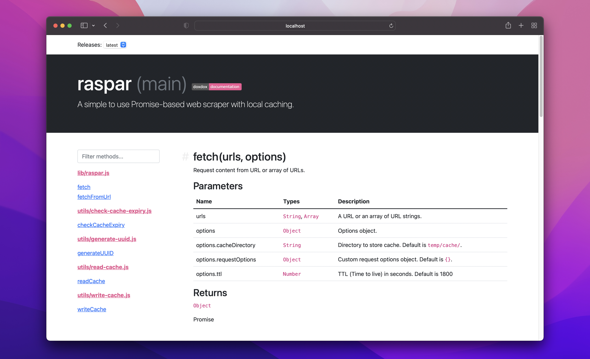

# [doxdox](https://doxdox.org/)

> JSDoc to Markdown, Bootstrap, and custom Handlebars template documentation generator.

[](https://travis-ci.org/neogeek/doxdox)
[](https://ci.appveyor.com/project/neogeek/doxdox)
[](https://codecov.io/gh/neogeek/doxdox)
[](https://david-dm.org/neogeek/doxdox)
[](https://snyk.io/test/npm/doxdox)
[](https://www.bithound.io/github/neogeek/doxdox)
[](https://www.npmjs.org/package/doxdox)
[](https://greenkeeper.io/)
[](https://doxdox.org/neogeek/doxdox)

doxdox is a simple to use documentation generator that takes JSDoc comment blocks and generates different documentation formats; [Markdown](http://daringfireball.net/projects/markdown/), [Bootstrap](https://v4-alpha.getbootstrap.com/), and custom [Handlebars](http://handlebarsjs.com/>) templates.

doxdox also features support for extendability via custom plugins for both parsing and generating documentation.

**In**

```javascript
/**
 * Parse array of directory globs and/or files, and then render the parsed data through the defined layout plugin.
 *
 *     parseInputs(['src/*.js'], {'ignore': [], 'parser': 'dox', 'layout': 'markdown'}).then(content => {});
 *
 * @param {Array} inputs Array of directory globs and/or files.
 * @param {Object} config Configuration object.
 * @param {String} config.ignore Array of paths to ignore.
 * @param {String} config.parser String representing the parser to be used.
 * @param {String} config.layout String representing the layout plugin to be used.
 * @return {Object} Promise
 * @public
 */
```

**Out**



_Bootstrap template plugin, included with doxdox_ <https://github.com/neogeek/doxdox-plugin-bootstrap>

## Getting Started

The following instructions assume you have already setup JSDoc comment blocks in your codebase. If you have not and would like to learn more about how to use JSDoc, visit <http://usejsdoc.org/>.

First install doxdox globally with [NPM](http://npmjs.com/).

```bash
$ npm install doxdox -g
```

Then, once you have doxdox installed globally (or local to your project, see below), you can start generating documentation. For this example, we will be generating a [Markdown](http://daringfireball.net/projects/markdown/) file and storing it within the project.

With a directory structure similar to the example shown below, run the following command to generate a [Markdown](http://daringfireball.net/projects/markdown/) file and output the generated contents to a new file named [`DOCUMENTATION.md`](DOCUMENTATION.md).

```bash
$ doxdox 'lib/**/*.js' --layout markdown --output DOCUMENTATION.md
```

```
├─ bin/
├─ coverage/
├─ lib/
│   ├─ doxdox.js
│   ├─ loaders.js
│   └─ utils.js
├─ node_modules/
└─ test/
     ├─ fixtures/
     └─ specs/
          ├─ doxdox.js
          ├─ loaders.js
          └─ utils.js
```

## Installation

doxdox can be installed via either [NPM](http://npmjs.com/) or [Yarn](https://yarnpkg.com/).

```bash
$ npm install doxdox -g
```

```bash
$ yarn global add doxdox
```

## Usage

### CLI

#### Layouts

_Markdown_

For more information on Markdown visit <http://daringfireball.net/projects/markdown/>.

```bash
$ doxdox 'lib/**/*.js' --layout markdown --output DOCUMENTATION.md
```

_Bootstrap_

Form more information on Bootstrap visit <https://v4-alpha.getbootstrap.com/>.

```bash
$ doxdox 'lib/**/*.js' --layout bootstrap --output docs/index.html
```

_Custom Handlebars Template_

For more information on writing Handlebars templates visit <http://handlebarsjs.com/>.

```bash
$ doxdox 'lib/**/*.js' --layout templates/README.hbs --output README.md
```

#### Ignore

The ignore flag allows you to ignore both directories (with glob syntax) and files. Comma separated values.

```bash
$ doxdox './**/*.js' --ignore './coverage/**/*.js'
```

See <https://github.com/isaacs/minimatch#usage> for more information on how to use globs.

#### Help

```
Usage: doxdox <path> ... [options]

Options:

 -h, --help             Display this help message.
 -v, --version          Display the current installed version.
 -d, --description      Sets description.
 -i, --ignore           Comma separated list of paths to ignore.
 -l, --layout           Template to render the documentation with.
 -o, --output           File to save documentation to. Defaults to stdout.
 -p, --package          Sets location of package.json file.
 -t, --title            Sets title.

Included Layouts:

 - Markdown (default)    (http://daringfireball.net/projects/markdown/)
 - Bootstrap             (http://getbootstrap.com/)
 - Handlebars            (http://handlebarsjs.com/)
```

### NPM Run Scripts

For more information on NPM run scripts visit <https://docs.npmjs.com/cli/run-script>.

```bash
$ npm install doxdox --save-dev
```

```json
{
  "devDependencies": {
    "doxdox": "2.0.1"
  },
  "scripts": {
    "docs": "doxdox 'lib/**/*.js' --layout markdown --output DOCUMENTATION.md"
  }
}
```

```bash
$ npm run docs
```

### Via JavaScript

```javascript
const doxdox = require('doxdox');

parseInputs(['lib/**/*.js'], {
    'parser': 'dox',
    'layout': 'markdown'
}).then(content => {

    process.stdout.write(content);

});
```

See [documentation](DOCUMENTATION.md) for more information on [`parseInputs`](DOCUMENTATION.md#parseinputsinputs-config).

## Packages

### Core Packages

All core packages come pre-installed with doxdox.

| Package | Version | Dependencies | Documentation |
| ------- | ------- | ------------ | ------------- |
| [`doxdox-parser-dox`](https://github.com/neogeek/doxdox-parser-dox) | [](https://www.npmjs.org/package/doxdox-parser-dox) | [](https://david-dm.org/neogeek/doxdox-parser-dox) | [](https://doxdox.org/neogeek/doxdox-parser-dox) |
| [`doxdox-plugin-bootstrap`](https://github.com/neogeek/doxdox-plugin-bootstrap) | [](https://www.npmjs.org/package/doxdox-plugin-bootstrap) | [](https://david-dm.org/neogeek/doxdox-plugin-bootstrap) | [](https://doxdox.org/neogeek/doxdox-plugin-bootstrap) |
| [`doxdox-plugin-handlebars`](https://github.com/neogeek/doxdox-plugin-handlebars) | [](https://www.npmjs.org/package/doxdox-plugin-handlebars) | [](https://david-dm.org/neogeek/doxdox-plugin-handlebars) | [](https://doxdox.org/neogeek/doxdox-plugin-handlebars) |
| [`doxdox-plugin-markdown`](https://github.com/neogeek/doxdox-plugin-markdown) | [](https://www.npmjs.org/package/doxdox-plugin-markdown) | [](https://david-dm.org/neogeek/doxdox-plugin-markdown) | [](https://doxdox.org/neogeek/doxdox-plugin-markdown) |

- [`doxdox-parser-dox`](https://github.com/neogeek/doxdox-parser-dox) - 🔌 Dox parser plugin for doxdox.
- [`doxdox-plugin-bootstrap`](https://github.com/neogeek/doxdox-plugin-bootstrap) - 🔌 Bootstrap template plugin for doxdox.
- [`doxdox-plugin-handlebars`](https://github.com/neogeek/doxdox-plugin-handlebars) - 🔌 Custom Handlebars template plugin for doxdox.
- [`doxdox-plugin-markdown`](https://github.com/neogeek/doxdox-plugin-markdown) - 🔌 Markdown template plugin for doxdox.

### Other Packages

Non-core packages must be installed separately from doxdox.

```bash
$ npm install doxdox doxdox-plugin-dash --save-dev
```

The, via the `--layout` flag, you specify the plugin name minus `doxdox-plugin-`.

| Package | Version | Dependencies | Documentation |
| ------- | ------- | ------------ | ------------- |
| [`doxdox-plugin-dash`](https://github.com/neogeek/doxdox-plugin-dash) | [](https://www.npmjs.org/package/doxdox-plugin-dash) | [](https://david-dm.org/neogeek/doxdox-plugin-dash) | [](https://doxdox.org/neogeek/doxdox-plugin-dash) |
| [`doxdox-plugin-github-wiki`](https://github.com/neogeek/doxdox-plugin-github-wiki) | [](https://www.npmjs.org/package/doxdox-plugin-github-wiki) | [](https://david-dm.org/neogeek/doxdox-plugin-github-wiki) | [](https://doxdox.org/neogeek/doxdox-plugin-github-wiki) |
| [`grunt-doxdox`](https://github.com/neogeek/grunt-doxdox) | [](https://www.npmjs.org/package/grunt-doxdox) | [](https://david-dm.org/neogeek/grunt-doxdox) | |

- [`doxdox-plugin-dash`](https://github.com/neogeek/doxdox-plugin-dash) - 🔌 Dash export plugin for doxdox.
- [`doxdox-plugin-github-wiki`](https://github.com/neogeek/doxdox-plugin-github-wiki) - 🔌 GitHub wiki export plugin for doxdox.
- [`grunt-doxdox`](https://github.com/neogeek/grunt-doxdox) - Grunt plugin for doxdox.

## Questions

If you have any questions regarding the use of doxdox, please use either the [Gitter](https://gitter.im/neogeek/doxdox) chat room or [Stack Overflow](http://stackoverflow.com/questions/ask?tags=doxdox). The issue tracker is to be used for bug reports and feature requests only.

## Contributing

Be sure to review the [Contributing Guidelines](CONTRIBUTING.md) before logging an issue or making a pull request.

## License

[MIT](LICENSE)
